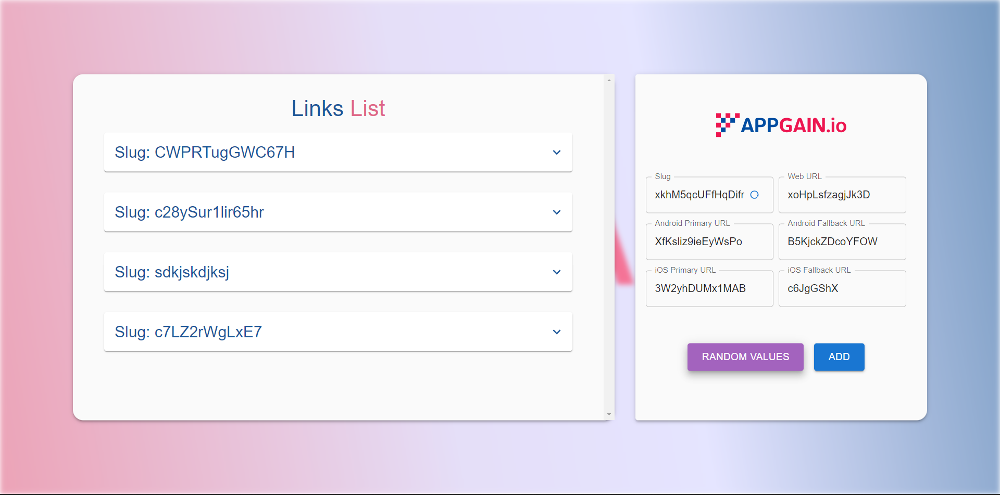
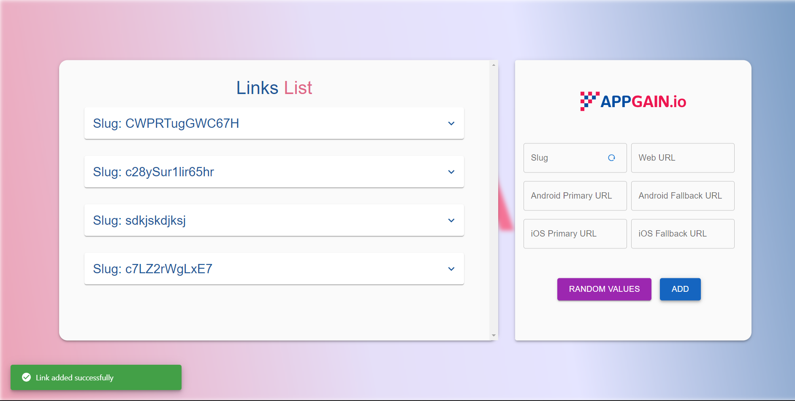
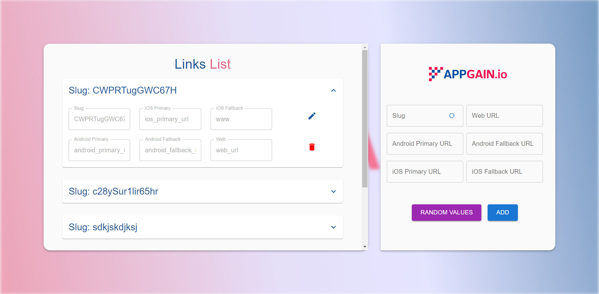
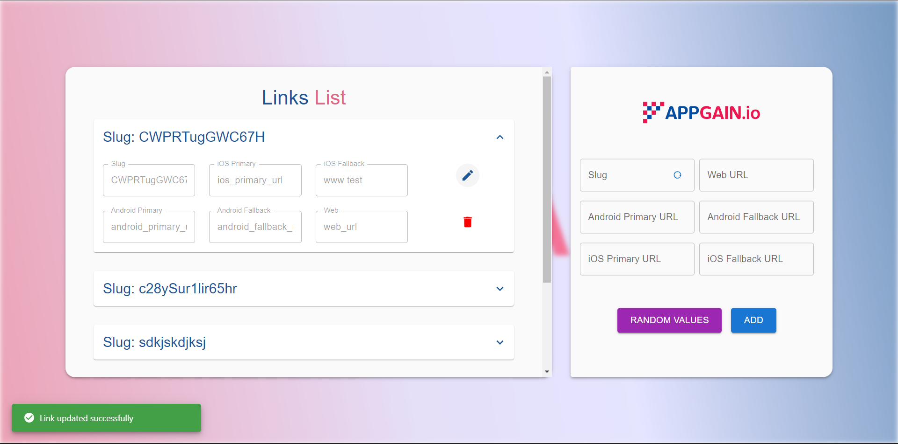
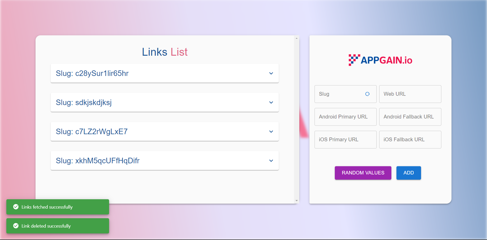
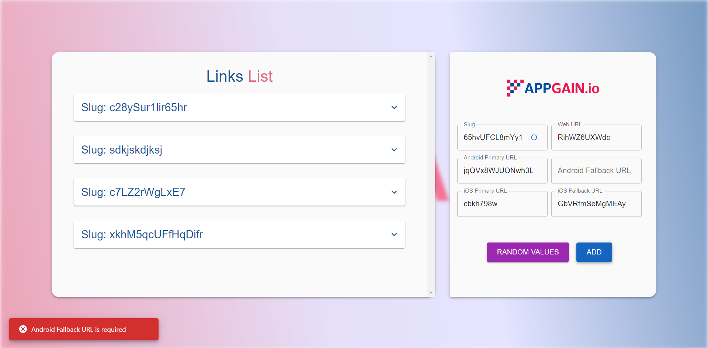

# MERN Stack Application Documentation

This repository contains a MERN (MongoDB, Express, React, Node.js) stack application.

## Technologies and Tools Used

The MERN stack application utilizes the following technologies and tools:

- MongoDB
- Express
- React
- Node.js
- Docker
- Ansible
- NGINX
- AWS (Amazon Web Services)

## Prerequisites

Before setting up the MERN stack application, ensure you have the following prerequisites installed:

- Node.js
- MongoDB
- Docker

## Installation

1. Clone the repository:

   ```bash
   git clone https://github.com/Waer1/short-link-generator
   cd short-link-generator
   ```

2. Install backend dependencies:

   ```bash
   cd backend
   npm install
   ```

3. Install frontend dependencies:

   ```bash
   cd frontend
   npm install
   ```

## Configuration

1. Backend Configuration:

   - Create a `.env` file in the `backend` directory.
   - Add the required environment variables to the `.env` file.

2. Frontend Configuration:

   - Create a `.env` file in the `frontend` directory.
   - Add the required environment variables to the `.env` file.

## Running the Application

1. Start the backend server:

   ```bash
   cd backend
   npm start
   ```

2. Start the frontend server:

   ```bash
   cd frontend
   npm start
   ```

3. Access the application in your browser at [http://localhost:3000](http://localhost:3000).


## Deployment

The MERN stack application is deployed to AWS (Amazon Web Services). To access the deployed application, visit [appgain.read-it.live](http://appgain.read-it.live) in your web browser.

To deploy the MERN stack application using Docker, follow these steps:

1. Install Docker on the deployment server.

2. Build the Docker images:

   ```bash
   docker-compose build
   ```

3. Start the Docker containers:

   ```bash
   docker-compose up -d
   ```

4. Access the deployed application using the server's IP address or domain.

**Note:** The deployed website requires Basic Authentication. Please use the following credentials to access it:
- Username: waer
- Password: waer

If you encounter any issues during installation or running the application, refer to the application's documentation or contact me through elwaeryousef@gmail.com.


## Screenshots

Here are some screenshots of the MERN stack application:

## Screenshots

Below are several screenshots showcasing different features of the MERN stack application:


*The basic layout of the website mainly consists of a list displaying existing links. Additionally, there is a "Generate Random Values" button for quickly creating new data.*


*At the bottom left, a snackbar appears to indicate the addition of a new link.*


*After clicking the edit button, all input fields become editable, except for the slug field.*


*You can make edits to the fields and then save the updated link.*


*Once you click the save button, a snackbar appears to confirm the successful update of the data. The edit fields return to their original state.*


*There is also a delete button that allows you to remove a link.*


*In this example, the first link has been successfully deleted, and a snackbar confirms the successful deletion.*


*Here's an example of validation: all fields except the slug field cannot be left empty. If the slug field is left empty, it will automatically generate a random value.*


## Troubleshooting

- If you encounter any issues during installation or running the application, refer to the application's documentation or contact me throught elwaeryousef@gmail.com


